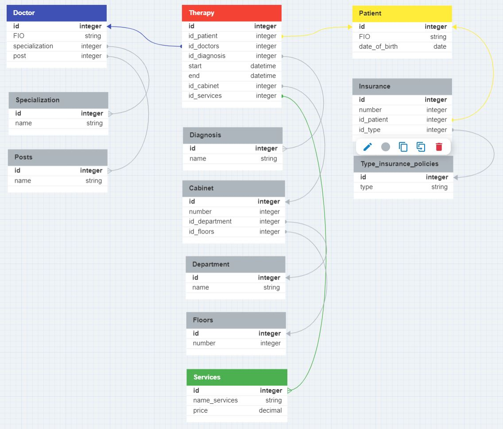
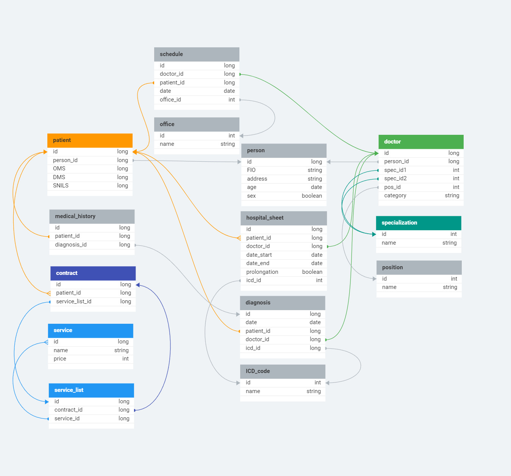
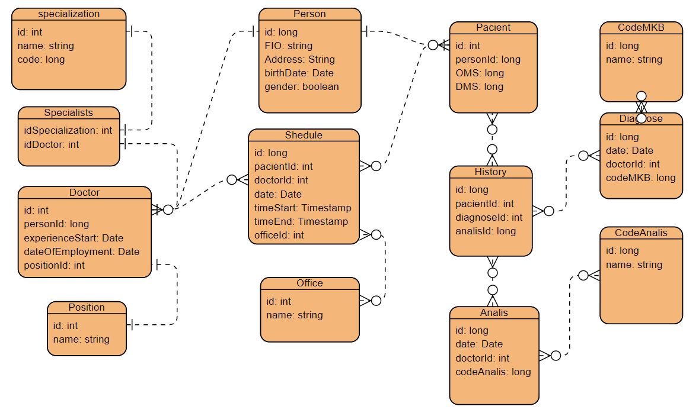
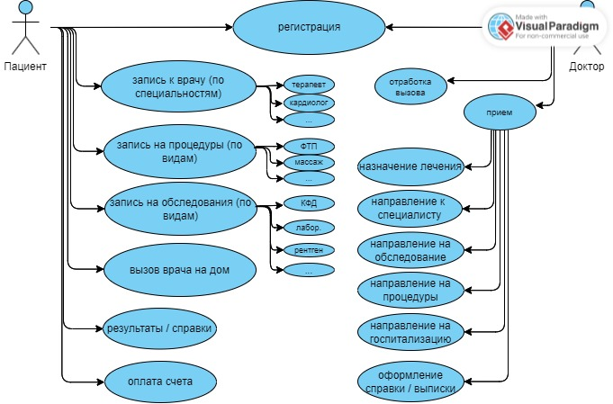
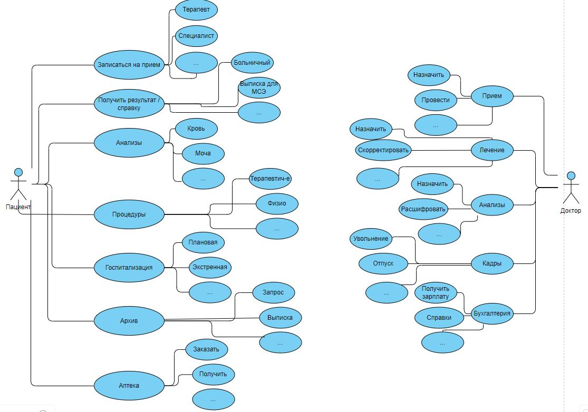

# Урок 6. Принципы построения приложений «чистая архитектура»

## Домашнее задание №6

**Задача 1**

Разработать полную ERD домена приложения автоматизации работы поликлиники.

( https://www.dbdesigner.net/).

_вариант 1_

_вариант 2_

_вариант 3_

**Задача 2**

Разработать UseCase диаграмму пациента и доктора в приложении автоматизации работы поликлиники.

(https://online.visual-paradigm.com/)

_вариант 1_

_вариант 2_

_вариант 3_

**Задача 3**

(Задание со \*) Скопировать себе в репозиторий шестигранную архитектуру и прокомментировать код(разобраться в нем).
