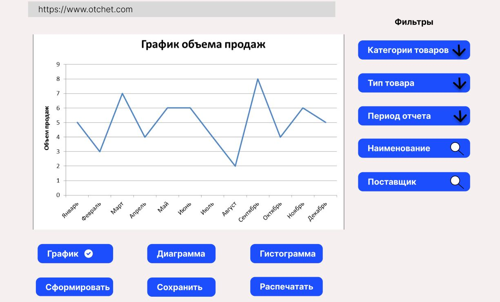
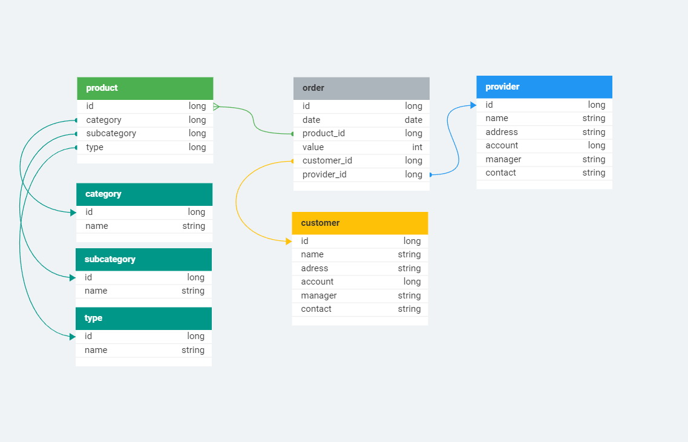
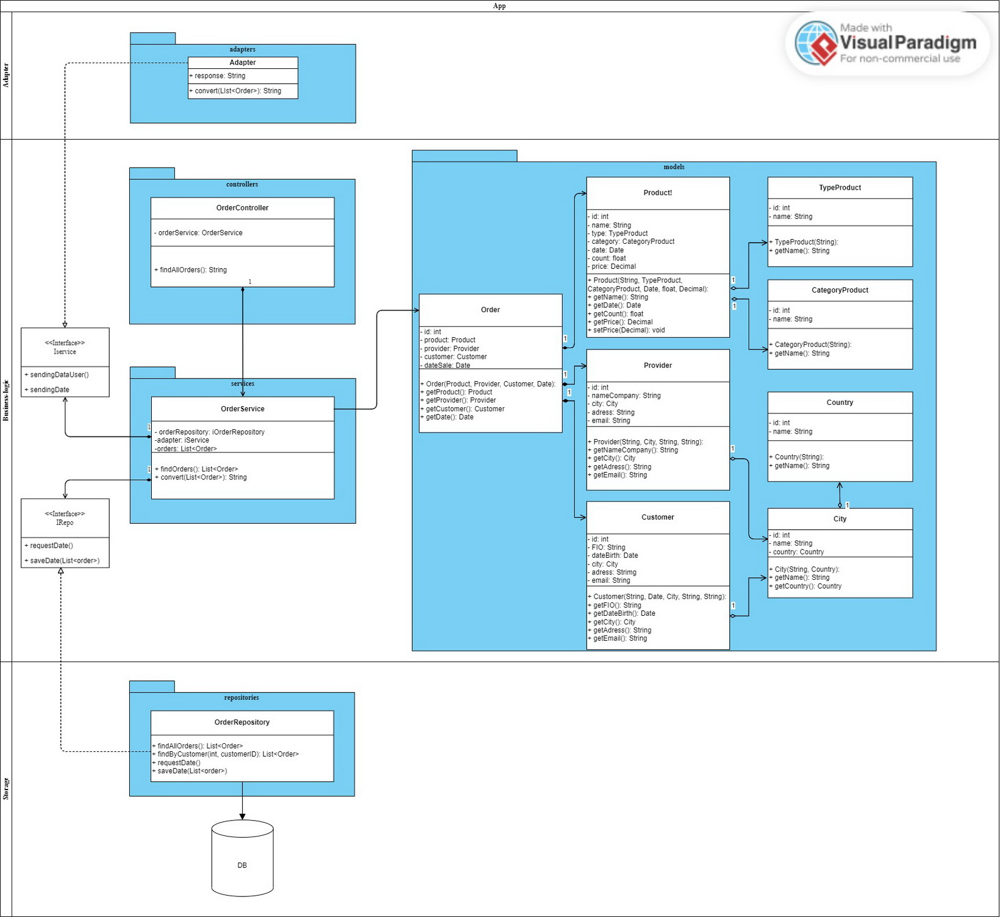
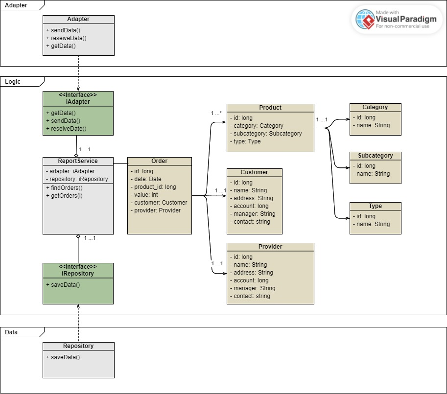

# Урок 7. Типы архитектур WEB-приложений: MPA, SPA.

## Домашнее задание №7

**Задача 1**

Доработать экранные формы интерфейса в https://www.figma.com/ или https://app.diagrams.net/.

_вариант 1_

_вариант 2_

**Задача 2**

Разработать полную ERD домена в https://www.dbdesigner.net/.

_вариант 1_

_вариант 2_

**Задача 3**

Разработать диаграмму компонент в UML включая слои пользовательского интерфейса и бизнес-логики.

_вариант 1_

_вариант 2_

