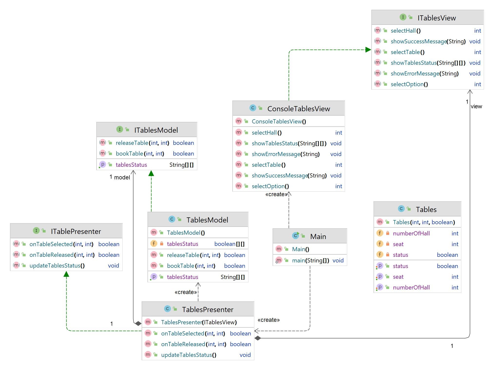

# Урок 8. Типы архитектур прикладных приложений (мобильные): MVC, MVP, MVVM.

## Домашнее задание №8

Для приложения заказа столика в ресторане сделать архитектурные документы:

**Задача 1**

Разработать экранные формы интерфейса(UI/UX) в https://www.figma.com/, https://pixso.net/ru/ или https://app.diagrams.net/.

**Задача 2**

Разработать полную ERD домена в https://www.dbdesigner.net/.

**Задача 3**

Разработать UML диаграмму классов

